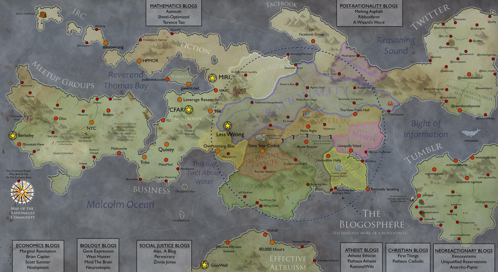

# Rationality Cartography (September 2014 Edition)

Map of the Rationality community made by [Scott Alexander](Scott%20Alexander.md) and [posted](https://slatestarcodex.com/2014/09/05/mapmaker-mapmaker-make-me-a-map/) to Slate Star Codex in 2014.

It's very telling that this map includes several recommendations for neoreactionary blogs.

## Map Contents

### IRC

### Fiction

### Facebook

### Twitter

### Tumblr

### Mathematics

### Websites

### Meetup Groups

### Nonprofits

### Businesses

### Effective Altruism

## The Blogosphere

### Economics

### General Niceness
### Medicine & Psych
### Neoreaction
### Post-Rationality
### Rationality
### Social Justice
### Xianity

## Other Recommended Blogs

### Atheist Blogs
- Atheist Ethicist
- Patheos Activist
- RationalWiki
### Biology Blogs
- Gene Expression
- West Hunter
- Mind The Brain
- Neuroskeptic
### Economics Blogs
- Marginal Revolution
- Brian Caplan
- Scott Sumner
- Noahpinion
### Christian Blogs
- First Things
- Patheos Catholic
### Mathematics Blogs
- Azimuth
- Shtetl-Optimized
- Tereance Tao
### Post-Rationality Blogs
- Melting Asphalt
- Ribbonfarm
- A Wizard's Word
### Neoreactionary Blogs
- Xenosystems
- Unqualified Reservations
- Anarcho-Papist
### Social Justice Blogs
- Alas, A Blog
- Pervocracy
- Zinnia Jones