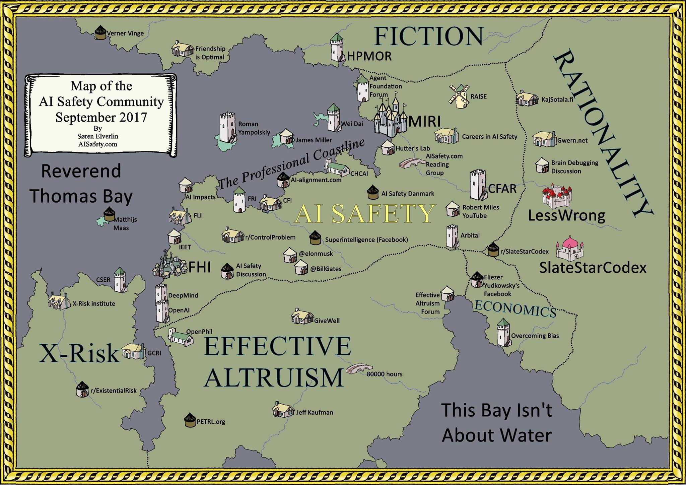

# Rationality Cartography (September 2017 Edition)

Created by Søren Elverlin. Links to [AISafety.com](https://www.aisafety.com)

This map was originally posted to [this URL](https://www.aisafety.com/2017/09/26/map-ai-safety-community), which now 404s. Elverlin included a link in a 2018 [comment](https://slatestarcodex.com/2018/07/19/sentimental-cartography/#comment-650311) on [Slate Star Codex](Scott%20Alexander.md)
> Last year, I made a map of the [AI Safety Community](https://aisafety.com/2017/09/26/map-ai-safety-community/). I plan to update it on a yearly basis.

## Map Contents

### AI Safety

### Fiction

### Rationality

### Effective Altruism

### X-Risk