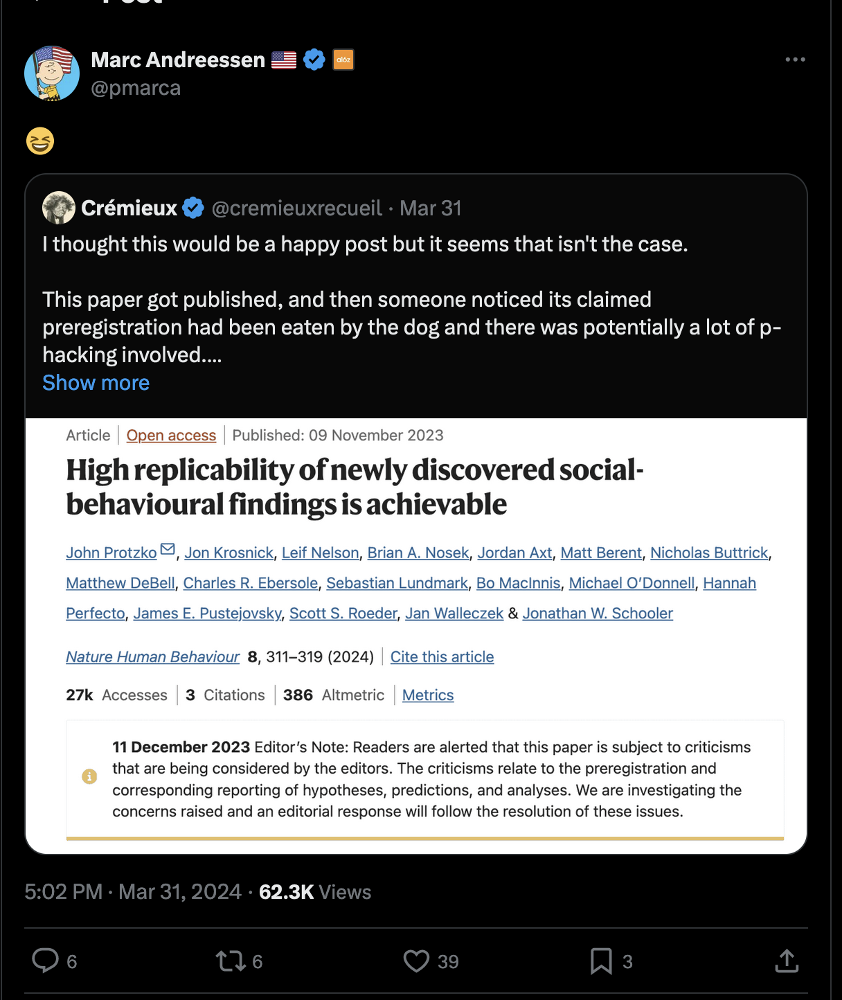
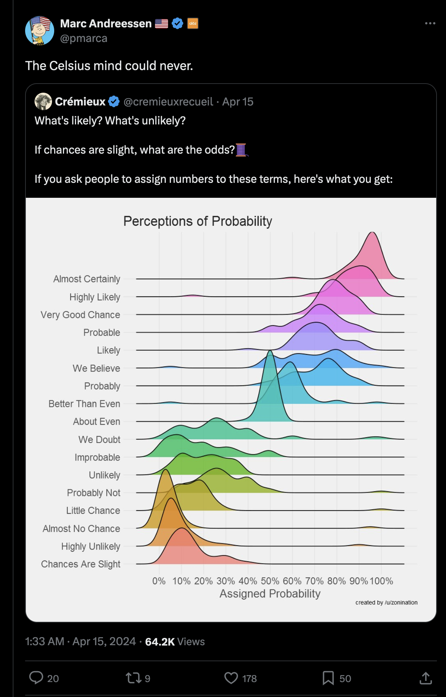
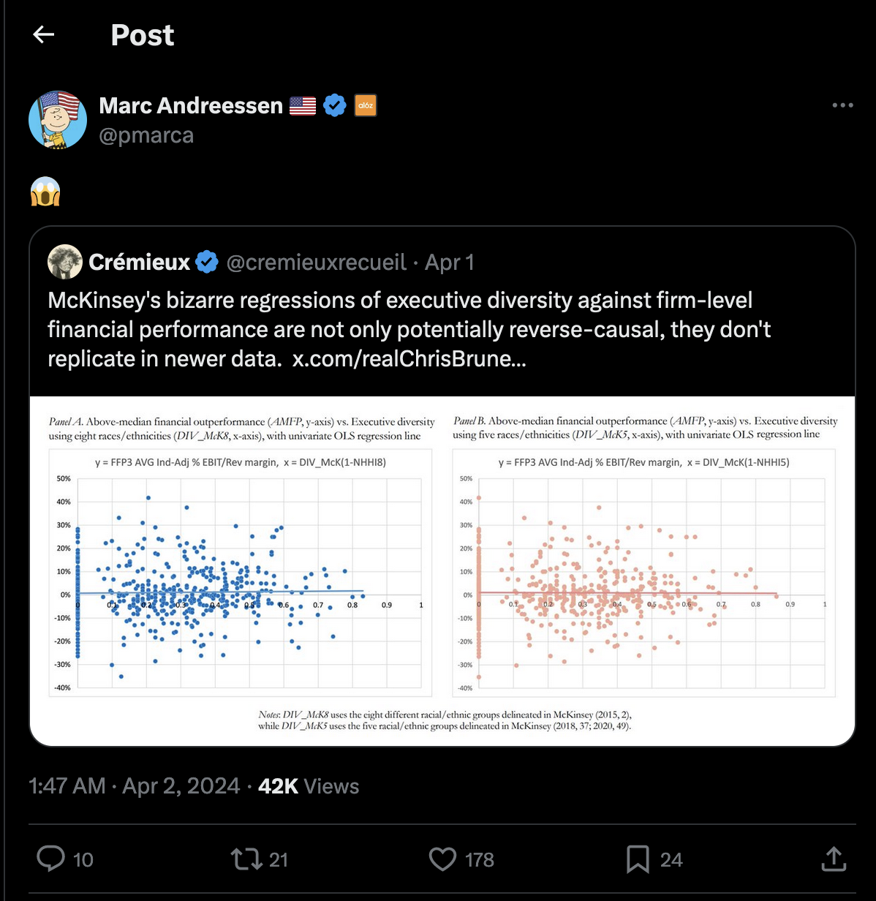
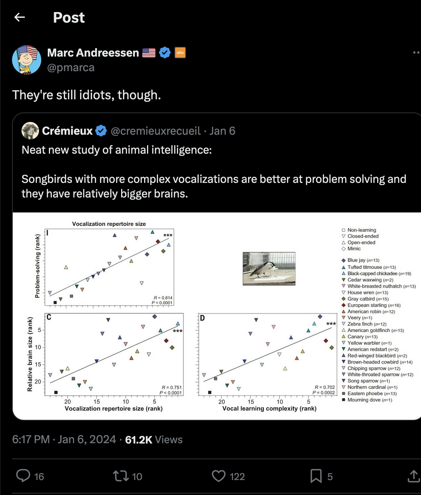

---
tags:
  - AI
  - X-Risk
  - EffectiveAccelerationism
  - VentureCapital
  - Crypto
  - Billionaires
---
# Marc Andreessen

[Twitter](https://twitter.com/pmarca) | [https://pmarca.substack.com/](Substack)

Co-founded Andreessen Horowitz.

### TESCREAL connections & commentary

In reference to the closure of [FHI](../Cartography/Avant-Gardea%20Arriere-Gardea/FHI.md), Andreessen [tweeted](https://twitter.com/pmarca/status/1780822794558656624) "Doomers vs commies. Commies won." along with a poster for the Alien vs. Predator movie.

Andressen has interacted with race scientist [Crémieux Recueil](Jordan%20Lasker.md) on a number of occasions ([1](https://twitter.com/pmarca/status/1743773874054115705), [2](https://twitter.com/pmarca/status/1775037437669957740), [3](https://twitter.com/pmarca/status/1779744740319326282)). 

Additionally, he has [agreed](https://twitter.com/pmarca/status/1769863122947379645) with [Garry Tan](Garry%20Tan.md), replying with a "💯" to a [tweet](https://twitter.com/garrytan/status/1769845264679133500) from Tan decrying "virtue signaling" and [posted](https://twitter.com/pmarca/status/1740429403996500014) a Stonetoss comic about climate activists.

Andreesseen's Substack recommendations include [Erik Torenberg](https://eriktorenberg.substack.com) and [Overcoming Bias](../Cartography/Sufferia%20Cynicia%20Psychonaut%20Bay/Cynicia/Overcoming%20Bias.md).

After an [interview](https://prospect.org/power/2024-04-24-my-dinner-with-andreessen/) with him, an author from The American Prospect concluded with the following:
>_“I’m glad there’s OxyContin and video games to keep those people quiet.”_
>
>I’m taking the liberty of putting it in quotation marks, though I can’t be sure those were his exact words. Marc, if you’re reading, feel free to get in touch and refresh my memory. Maybe he said “quiescent,” or “docile,” or maybe “powerless.” Something, certainly, along those lines.
>
>He was joking, sort of; but he was serious—definitely_._ “Kidding on the square,” jokes like those are called. All that talk about human potential and morality, and this man afire to reorder life as we know it jokingly welcomes chemical enslavement of those he grew up with, for the sin of not being as clever and ambitious as he.
>
>There is something very, very wrong with us, that our society affords so much power to people like this.

## Conspiracy Beliefs

Andreessen went on Joe Rogan in July 2023 and [falsely claimed](https://apnews.com/article/fact-check-nukes-fake-camera-conspiracy-rogan-742805510402) that nuclear weapons tests were faked because the cameras used to film the videos presented as evidence should've been destroyed by the blasts - this was later refuted by the Associated Press.

## Techno-Optimist Manifesto

(TODO: add sources)

### Endorsement of Italian Fascism

(TODO: fill this out)

https://pmarca.substack.com/p/the-techno-optimist-manifesto?utm_source=profile&utm_medium=reader2

https://pmarca.substack.com/p/why-ai-will-save-the-world