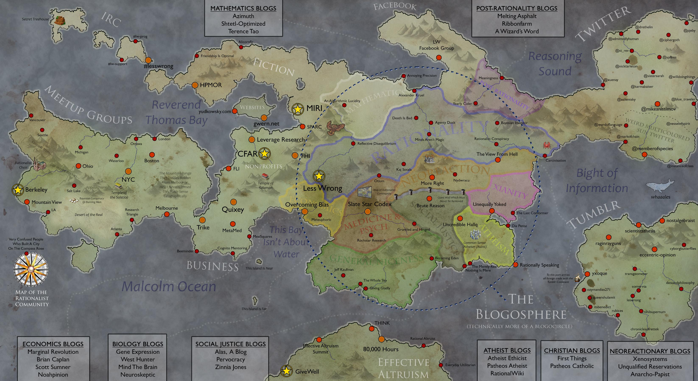
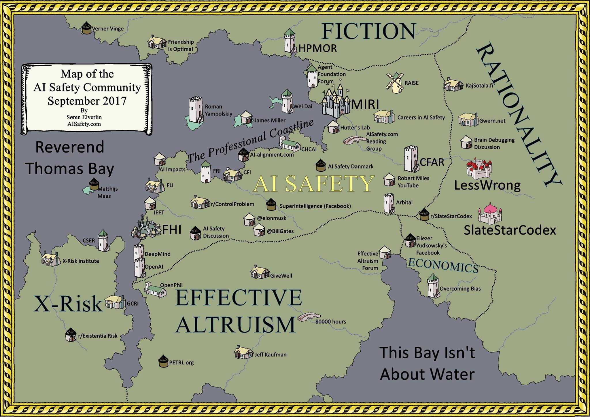
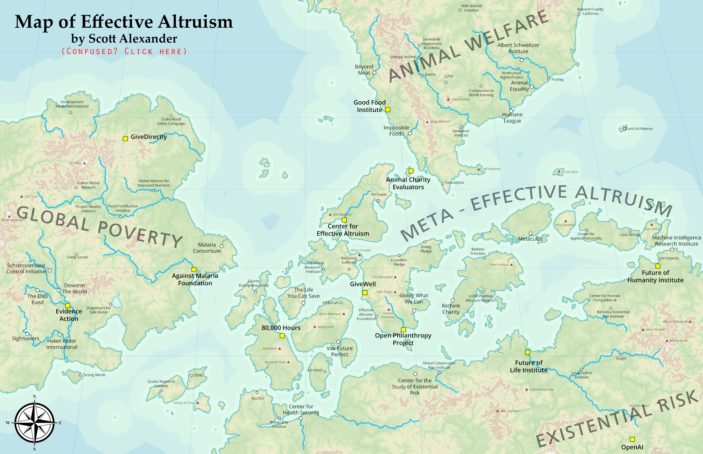

This is what is tentatively titled the "TESCREAL  Cartography" project. It's a wiki-like aims to collect, organize, and critically analyze information about the transhumanist, Rationalist, effective altruism, longtermism, and AI existential risk communities with a particular focus on the eugenicist and abusive elements of the community. This work is very much incomplete at the moment and many pages don't contain more than my collection of notes and sources.

# Cartography of AI Doomsday Ideologies

The impetus for this project was a desire to understand an anonymously-made [map of the online Rationalist space](Cartography/map_full.jpg) that was [posted](https://www.astralcodexten.com/p/links-for-october-397) to Scott Alexander's [Astral Codex Ten](pages/Astral%20Codex%20Ten.md) blog in 2022. 

Upon further research, I discovered several other maps, some of which appear to be by the same creator.

### [2014 Map](./map-2014)

### [2017 Map](map-2017.md)

### [2020 Map](map-2020.md)

### [2022 Map](./map-2022)

### [2023 Map: AI Safety](./map-2023)

--- 

Some of the information here has previously been compiled on other platforms such as [RationalWiki](https://rationalwiki.org) and [InfluenceWatch](https://www.influencewatch.org). However, those websites don't have a focus on sci-fi and effective altruism specifically; this project aims to collect this knowledge as it pertains to TESCREAL in an organized fashion. 

Vipul Naik's [financial information database](https://donations.vipulnaik.com) and AI Panic's [Guide to AI Existential Risk](https://www.aipanic.news/p/ultimate-guide-to-ai-existential)are also good sources of information.

If you want to get involved or have a correction, please hit me up on [Twitter](https://www.twitter.com/thecollegehill).

### sitemap

- [main wiki](./Cartography/index.md)
- older Rationality maps: [February 2014](Cartography%20(September%202014)/index.md), [September 2017](Cartography%20(September%202017)/index.md),[February 2020](Cartography%20(February%202020)/index.md), [2020 (AI Safety World)](Cartography%20(AI%20Safety%20World)/index.md)

### Major TODOs

* Incorporate content from Nirit Weiss-Blatt's guide: https://www.aipanic.news/p/ultimate-guide-to-ai-existential
* Incorporate more content from RationalWiki
* Investigate/document the Ziz/Michael Vassar cult fighting saga
* Look into Authentic Relating & Circling
* Investigate the pro poker and pro Magic the Gathering connections to EA
* Document/investigate recommendations from GiveWell and Animal Charity Evaluators
* Find all EA sponsored YouTubers (Legal Eagle, Kurzgesazt, Tier Zoo, etc)
* Document/quantify rationalist influence on Wikipedia. A lot of rationalists edit the site
	* Count how many EA or rationalist Wikipedia article have warnings (neutrality, written like an ad, too close to the main subject, etc)
* Add organization logos to pages
* Add tags to pages
* Fill out empty links to Wikipedia and other sites