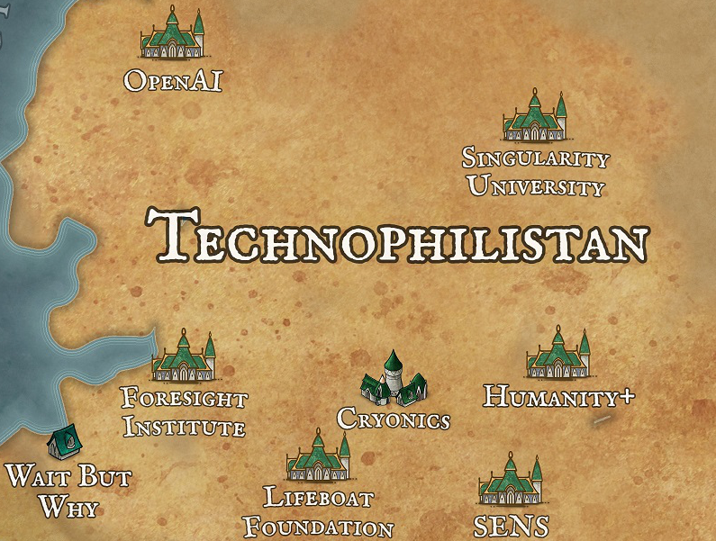

# 2022 Map

Posted to [Astral Codex Ten](pages/Astral%20Codex%20Ten.md) on Oct 12, 2022 [here]( https://www.astralcodexten.com/p/links-for-october-397
). Discovering this map was the original inspiration for this wiki. It's divided into continents, each representing a broad focus:

- [The Expanding Arctic Circle](#The%20Expanding%20Arctic%20Circle)
- [The Climate Zone](#The%20Climate%20Zone)
- [Greater Wrongia](#Greater%20Wrongia)
- [Emeritia](#Emeritia)
- [Puzzalia](#Puzzalia)
- [Techliberia](#Techliberia)
- [Spiritia](#Spiritia)

# The Expanding Arctic Circle
## The Animal Kingdom / Animalea 

This section contains EA orgs and people who focus on animal rights. It includes:
- [Animal Charity Evaluators (ACE)](../../pages/ACE.md)
- [The Humane League](../../pages/Humane%20League.md)
- [Peter Singer](../../pages/@petersinger.md)
## Ceterea

- [ALLFED](pages/ALLFED.md)
- [Effective Giving](pages/Effective%20Giving.md)
- [GCRI](pages/GCRI.md)
## Povertea

This section contains EA orgs and people who focus on animal rights. It includes:

- [AMF](pages/AMF.md)
- [GiveDirectly](pages/GiveDirectly.md)
- [Giving What We Can](pages/GWWC.md)
- [J-PAL](pages/J-PAL.md)
- [Rethink Charity](pages/Rethink%20Charity.md)
- [The Life You Can Save](pages/The%20Life%20You%20Can%20Save.md)
- [Wave](pages/Wave.md)

# The Climate Zone

**There's nothing here. This is because effective altruists generally don't take climate change very seriously**.

# Emeritia

### Members
- [Bulletin of the Atomic Scientists](Bulletin%20of%20the%20Atomic%20Scientists.md)
- [Centre for the Study of Existential Risk](CSER.md)
- [Future of Life Institute](FLI.md)
- [Foundational Questions Institute](FQXI.md)
- [Leverhulme Centre for the Future of Intelligence](Leverhulme%20CFI.md)

# Greater Wrongia

The central "continent" on the map. It includes those directly associated with [LessWrong](pages/LessWrong.md) and Rationality.
## Lesser Wrongia

This section includes most things directly related to [LessWrong]().

- [Aceso Under Glass](pages/Aceso%20Under%20Glass.md)
- [Agenty Duck](pages/Agenty%20Duck.md)
- [Alignment Forum](pages/Alignment%20Forum.md)
- [Applied Divinity Studies](pages/Applied%20Divinity%20Studies.md)
- [Astral Codex Ten](pages/Astral%20Codex%20Ten.md)
- [Atlas](pages/Atlas.md)
- [AXRP](pages/AXRP.md)
- [[Bayesian Choir]]
- [[Bayesian Investor]]
- [[CFAR]]
- [[Conjecture]]
- [[Duncan Sabien]]
- [[ESPR]]
- [[Glowfic]]
- [[Gwern]]
- [[LessWrong]]
- [[LIT]]
- [[Meetup Groups]]
- [[MIRI]]
- [[r/rational]]
- [[Rationally Speaking]]
- [[REG]]
- [[Robert Miles]]
- [[SERI]]
- [[SFF]]
- [[Shtetl-Optimized]]
- [[Steven Kaas]]
- [[The Unit of Caring]]
- [[Thing of Things]]
- [Weird Multicolored Sun Twitter](pages/Weird%20Multicolored%20Sun%20Twitter.md)

## Sufferia, Cynicia & The Psychonaut Bay

### Sufferia

- [Kaj Sotala](pages/Kaj%20Sotala.md)
- [CLR](pages/CLR.md)
- [Reducing Suffering](pages/Reducing%20Suffering.md)
### Cynicia

- [Median Group](pages/Median%20Group.md)
- [Bismarck Analysis](pages/Bismarck%20Analysis.md)
- [Leverage](pages/Leverage.md)
- [Overcoming Bias](pages/Overcoming%20Bias.md)
### The Psychonaut Bay

This section relates to [Psychedelics](pages/Psychedelics.md).

- [Aella](pages/Aella.md)
- [Malcolm Ocean](pages/Malcolm%20Ocean.md)

# Puzzalia

TESCREAL groups related to decision theory and gaming.

- [Azimuth](Azimuth.md)
- [Cryptic Ruins](Cryptic%20Ruins.md)
- [IMO](IMO.md)
- [Jane Street](Jane%20Street.md)
- [Judea Pearl](@yudapearl.md)
- [Magic: The Gathering](MtG.md)
- [Poker](Poker.md)
- [Topos Institute](Topos%20Institute.md)
# Techliberia

## Cognitia

- [Good Judgement Project](../../pages/Good%20Judgement%20Project.md)
- [Information Processing](../../pages/Information%20Processing.md)
- [Metaculus](../../pages/Metaculus.md)
- [[Nate Silver](pages/Nate%20Silver.md)]
- [Our World In Data](../../pages/Our%20World%20In%20Data.md)
- [Stat Modeling](../../pages/Stat%20Modeling.md)

## Neoliberia

The Neoliberal section of the TESCREAL map. This is the classical definition of "neoliberal", which is why it includes conservatives and libertarians like Dom Cunnings and Tyler Cowen.

- [Asymmetricinfo](pages/Asymmetricinfo.md)
- [Bet On It](pages/Bet%20On%20It.md)
- [Dominic Cummings](pages/Dominic%20Cummings.md)
- [Marginal Revolution](pages/Marginal%20Revolution.md)
- [Progress Studies](pages/Progress%20Studies.md)
- r/neoliberal
- [Slow Boring](pages/Matthew%20Yglesias.md)
- [The Ezra Klein Show](pages/The%20Ezra%20Klein%20Show.md)
- [EconLog](pages/EconLog.md)
## Technomundistan 

The Technomundistan section is divided into three sections on the map.

**Section 1 (East)**

- [DeepMind](pages/DeepMind.md)

**Section 2 (Southeast)'

- [SMBC](pages/SMBC.md)
- [Stripe](pages/Stripe.md)
- [CGP Grey](pages/CGP%20Grey.md)
- [@ylecun](pages/Yann%20LeCun.md)

**Section 3 (Southwest)**

- [A Capella Science](pages/A%20Capella%20Science.md)
- [Cryptocurrency](pages/Cryptocurrency.md)
- [@balajis](pages/@balajis.md) (not very mundane)
- [Venture](pages/Venture.md)

## Technophilistan

- [OpenAI](pages/OpenAI.md)
- [Singularity University](pages/Singularity%20University.md)
- [Humanity+](pages/Humanity+.md)
- [Cryonics](pages/Cryonics.md)
- [SENS](pages/SENS.md)
- [Lifeboat Foundation](pages/Lifeboat%20Foundation.md)
- [Foresight Institute](pages/Foresight%20Institute.md)
- [Wait But Why](pages/Wait%20But%20Why.md)
## Twiliberia

- [r/starslatecodex](r-starslatecodex.md)
- [Ribbonfarm](Ribbonfarm.md)
- [r/themotte](r-themotte.md)
- [Razib Khan](Razib%20Khan.md)
- [@primalpoly](@primalpoly.md)
- [Converstations with Coleman](Converstations%20with%20Coleman.md)
- [Quillette](Quillette.md)
- [@sapinker](@sapinker.md)
- [@elonmusk](@elonmusk.md)
- [Thiel Foundation](Thiel%20Foundation.md)
- [Heterodox Academy](Heterodox%20Academy.md)
- [Making Sense](Making%20Sense.md)
- [Hacker News](pages/Hacker%20News.md)
## Mainstream Culture War Borderlands

- [Future Perfect]()

# Spiritia

This is the spiritual part of TESCREAL.

- [Authentic Relating](pages/Authentic%20Relating.md)
- [Critical Rationalists](pages/Critical%20Rationalists.md)
- [Meaningness](pages/Meaningness.md)
- [MAPLE](pages/MAPLE.md)
- [Qualia Research Institute](pages/QRI.md)
- [Vibers](pages/Vibers.md)
- [@webmasterdave](pages/@webmasterdave.md)
- [Black Rock City](pages/Burning%20Man.md)

### Other

[[The Seasteading Institute](pages/The%20Seasteading%20Institute.md)] is on its own island, 