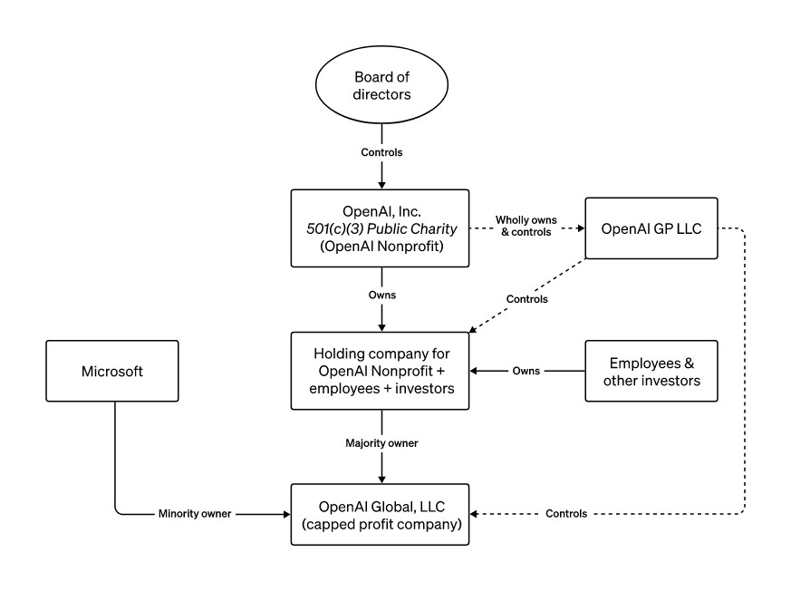

---
tags:
  - Technomundistan
  - Map2022
---
# OpenAI

[Website](https://openai.com/) | [Wikipedia](https://en.wikipedia.org/wiki/OpenAI) |  [Twitter](https://twitter.com/OpenAI)

## About

It's OpenAI.

### Media coverage

https://www.wired.com/story/what-openai-really-wants

### Coporate Structure

#### Board of Directors

##### Current
- (TODO)
- **Dr. Sue Desmond-Hellmann**
- **Nicole Seligman**
- **Fidji Simo**

On March 8, 2024, OpenAI [announced](https://openai.com/blog/openai-announces-new-members-to-board-of-directors)the addition of three new board members as well as the return of CEO Sam Altman to the board.

##### Former

(TODO)

### November 2023 CEO Drama

##### Timeline of events

(TODO)

### Sora

https://openai.com/index/video-generation-models-as-world-simulators/

> Sora is also able to simulate artificial processes–one example is video games. Sora can simultaneously control the player in Minecraft with a basic policy while also rendering the world and its dynamics in high fidelity. These capabilities can be elicited zero-shot by prompting Sora with captions mentioning “Minecraft."

> These capabilities suggest that continued scaling of video models is a promising path towards the development of highly-capable simulators of the physical and digital world, and the objects, animals and people that live within them.